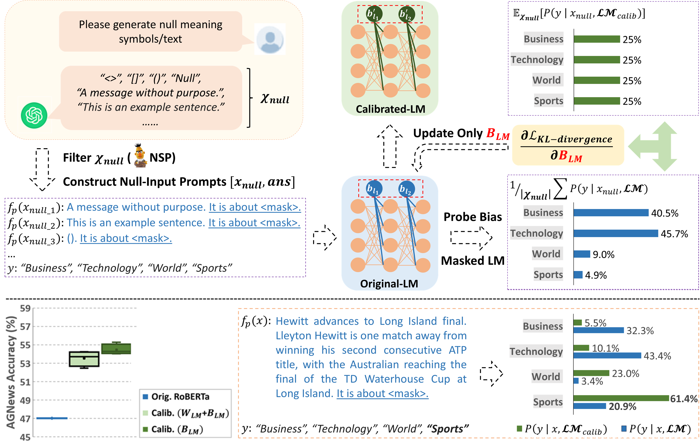

# Enhancing Zero/Few-Shot Learning of Pre-trained Language Models via Bias Calibration
This is the implementation of the paper [Prompt-Based Bias Calibration for Better Zero/Few-Shot Learning of Language Models](https://arxiv.org/abs/2402.10353)
(EMNLP 2024 Findings). Code is modified from [LM-BFF](https://github.com/princeton-nlp/LM-BFF).

## Overview
We propose a null-input prompting method for calibrating intrinsic bias of pre-trained language models, aiming to enhance language models’ zero/few-shot performance for both in-context learning and prompt-based fine-tuning. Here are some main contributions:
- A new perspective of improving pre-trained LM zero/few-shot learning via _intrinsic-bias calibration_.
- Unsupervised intrinsic bias calibration using KL-divergence loss.
- Efficiency and minimal model updates.
  

